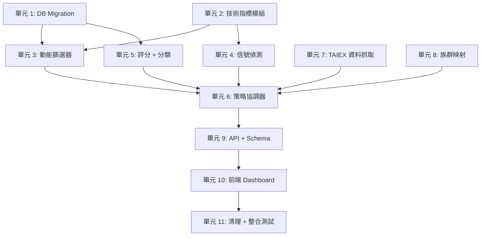

# feat: 以動能策略引擎取代現有評分系統

## 概述

將現有的三維評分引擎（籌碼 40% + 基本面 35% + 技術面 25%）替換為純動能/趨勢策略。新引擎執行 11 步量化流程：市場趨勢偵測、族群強度排序、多重篩選、信號偵測（吸籌、突破、飆股）、綜合評分、分類（BUY/WATCH/EARLY/IGNORE）、以及交易計畫生成（Buy/Stop/Add/Target 價位）。

第一位用戶（創辦人父親，有經驗的投資人）使用現有系統後認為篩選結果不符合他的動能/趨勢交易風格，透過與 AI 討論產出了一份完整的策略規格。

## 問題框架

現有評分模型混合了籌碼面、基本面和技術面。目標用戶是純動能/趨勢交易者，他關心的是：相對於大盤的強度、突破型態、吸籌信號、以及族群輪動。現有模型的輸出與他的交易決策不匹配。

成功標準 = 父親打開 Dashboard，看到各族群 Top 6 + 綜合排行，然後說「這些股票我會想買」。

## 需求追溯

- R1. 市場趨勢門檻：TAIEX MA20 >= MA60 → UPTREND（繼續篩選），< → DOWNTREND（空清單 + 警示）
- R2. 族群強度：兩層分類（TWSE 官方 + 自定義 JSON），依 20 日報酬排名，取前 5 族群
- R3. 多重篩選管線：價格 > 20、成交量 > 1000、MA20 > MA60、10 日報酬 > 大盤
- R4. 信號偵測：吸籌（量增 + 橫盤 + 低點墊高）、突破（20 日高 +1%、量放大 1.5 倍）、飆股（RS 60 日新高 + ATR 收縮 25% + 量縮 30%）
- R5. 綜合評分：RS + RSI + ADX + Volume + Breakout + Accumulation，等權重，正規化 0-100
- R6. 分類：BUY（突破 + 分數 >= 70 + 強勢族群）、WATCH（分數 >= 60 + 上升趨勢）、EARLY（吸籌 + 分數 >= 50）、IGNORE（其他）
- R7. 交易計畫：Buy = 20 日高 × 1.01、Stop = 10 日低、Add = MA20 回測、Target = Buy + 2×ATR(14)
- R8. Dashboard：各族群 Top 6 + 綜合排行、市場趨勢紅綠燈、族群強度顯示
- R9. Pipeline 整合：每日收盤後透過現有 cron-trigger 執行
- R10. 現有 AI 報告和認證系統不可壞

## 範圍邊界

- 不新增頁面或路由。僅替換現有 Dashboard 內容。
- 不做面向用戶的策略設定 UI（父親直接編輯 JSON 設定檔）。
- 此階段不整合回測功能。
- 舊的評分檔案（chip_scorer.py、fundamental_scorer.py、scoring_engine.py）將直接刪除，不做 deprecated。

## 背景與研究

### 相關程式碼與模式

**現有評分管線（將被替換）：**
- `backend/app/services/scoring_engine.py`（271 行）— 協調器，呼叫 3 個評分器
- `backend/app/services/chip_scorer.py`（226 行）— 籌碼面情緒分析
- `backend/app/services/fundamental_scorer.py`（334 行）— 公司基本面指標
- `backend/app/services/technical_scorer.py`（364 行）— 技術面指標
- `backend/app/services/hard_filter.py`（182 行）— 成交量預篩選

**可複用的指標計算（來自 technical_scorer.py）：**
- RSI(14) 計算，透過 `_calculate_rsi_score()`
- MA(5/10/20/60/120)，透過 `_calculate_ma_score()`
- 量比，透過 `_calculate_volume_score()`
- 這些都是基於 pandas 的純計算，可以直接抽取

**Pipeline 框架（保留）：**
- `backend/app/tasks/daily_pipeline.py`（233 行）— 協調器：抓資料 → 篩選 → 評分
- `backend/app/tasks/analysis_steps.py`（85 行）— `step_hard_filter()`、`step_scoring()`
- `backend/app/tasks/data_fetch_steps.py`（921 行）— TWSE + FinMind 雙資料源

**DB Model：**
- `backend/app/models/score_result.py`（30 行）— ScoreResult，含 chip_score、fundamental_score、technical_score、total_score、rank

**API + 前端：**
- `backend/app/routers/screening.py`（460 行）— `_build_score_responses()` 批次建構器
- `backend/app/schemas/screening.py` — Pydantic 回應結構
- `frontend/src/views/dashboard-view.vue`（~400 行）— Dashboard 可排序表格
- `frontend/src/types/screening.ts`（24 行）— ScoreResult 介面
- `frontend/src/components/dashboard/stock-ranking-table.vue` — 表格元件

**引用舊評分欄位的檔案（完整影響範圍）：**
- 後端服務：scoring_engine、chip_scorer、fundamental_scorer、technical_scorer、custom_screening_service、chat_service
- 後端路由：screening、custom_screening
- 後端模型：score_result
- 後端 schemas：screening
- 後端任務：analysis_steps
- 後端測試：test_scoring_engine、test_chat_service、test_backtest_service、test_report_cache、test_models
- 前端頁面：dashboard-view、custom-screening-view
- 前端元件：stock-ranking-table、factor-score-card、filter-builder-form、screening-result-table
- 前端 API：screening-api、custom-screening-api
- 前端型別：screening
- 腳本：generate-scoring-logic-ppt

### 機構學習記錄

- **direct-replace-not-parallel**（信心 10/10）：用戶強烈偏好直接替換。不保留 deprecated 欄位，不做向後相容。
- **father-as-gatekeeper**（信心 9/10）：父親透過查看輸出品質（Top N 清單）來判斷，而非調參數。使用合理預設值並迭代。
- **sector-two-layer**（信心 10/10）：TWSE 官方（~30 類）為基底 + 自定義 JSON 覆蓋。

### 外部參考

- ADX 計算：Wilder 方向運動系統（14 期預設）
- ATR 計算：Wilder 真實波幅平均（14 期）
- RS（相對強度）：IBD 風格的個股報酬 / 大盤報酬比率

## 關鍵技術決策

- **模組結構：`services/momentum/` 套件** — 拆為 filters.py、signals.py、strategy.py 以符合 200 行限制。相關邏輯集中放置。Scoring 放在獨立的 `momentum_scoring.py`，因為 strategy 和 router 都會使用。
- **抽取指標到 `technical_indicators.py`** — 純函式，無副作用，可跨 strategy 和 scoring 複用。避免重複 technical_scorer.py 中已有的 RSI/MA 計算。
- **RS 邊界情況：大盤報酬 <= 0 時改用差值法** — 避免除以零/負數。TAIEX 20 日報酬為 0 或負值時，用（個股報酬 - 大盤報酬）取代比率。簡單且可辯護。
- **Alembic migration：一次刪舊加新** — 設計上不可逆。舊評分模型是被替換，不是演進。每日 Pipeline 重新計算所有資料，不需 backfill。
- **族群 JSON 設定：檔案為基礎，無管理 UI** — 父親編輯 JSON 檔案。下次 Pipeline 執行時自動載入（執行時讀取，不做快取 = 熱重載）。單一用戶把關人的最簡方案。
- **TAIEX 資料：Pipeline 新增抓取步驟** — FinMind `TaiwanMarketIndex` 搭配 TWSE 備援。與現有股票資料抓取相同的雙資料源模式。
- **Dashboard 佈局：族群分組 + 綜合排行** — 同一頁面兩種視圖。族群分組顯示每族群 Top 6。綜合排行將所有股票依動能分數混合排序。兩者共享相同資料，不同排序/分組。

## 待解問題

### 規劃期間已解決

- **TWSE 產業 API**：不需額外端點。Stock 模型已有 `industry` 欄位（`backend/app/models/stock.py:16`），資料從 TWSE PER/PBR API 抓取時自帶。直接用 `Stock.industry` 作為族群 Layer 1。
- **ADX 計算**：標準 Wilder 方法。平滑因子 = 1/14（Wilder 平滑），初始值用前 14 期簡單平均。業界標準做法，無歧義。
- **Dashboard 族群分組佈局**：卡片佈局（每族群一張卡片），桌面端 2 欄、手機端 1 欄。卡片內 Top 6 用表格。與現有 Dashboard 卡片模式一致。
- **評分權重**：等權重（各 1/6）。父親透過查看結果來調整，不是調參數。
- **吸籌閾值**：量增 1.3 倍（5 日/20 日）、橫盤 < 5% 波動率（10 日）、低點墊高（5 日 vs 前 5 日）。合理預設值，可調。
- **目標價**：Entry + 2× ATR(14)。標準 2R 風報比。
- **DOWNTREND 行為**：完全停止選股。Dashboard 空清單 + 警示訊息。
- **族群分類**：兩層（TWSE + 自定義 JSON）。自定義覆蓋 TWSE。

### 延至實作時解決

（無。所有問題已在規劃期間解決。）

## 高階技術設計

> *此圖說明預期的方法，為審查用的方向性指引，非實作規格。實作者應將其視為背景脈絡，而非需要重現的程式碼。*

```
PIPELINE 流程（每日收盤後）
=========================================

data_fetch_steps.py
  |
  +-- _fetch_taiex_daily()  [新增]
  |     -> MarketIndex 資料表（TAIEX OHLCV）
  |
  +-- 現有股票資料抓取
        -> DailyPrice 資料表（個股）

analysis_steps.py
  |
  +-- step_hard_filter()  [修改]
  |     momentum/filters.py:
  |       價格 > 20、成交量 > 1000
  |       MA20 > MA60
  |       10 日報酬 > 大盤報酬
  |     -> 候選 stock_ids
  |
  +-- step_scoring()  [修改]
        momentum/strategy.py（協調器）：
          1. 檢查市場趨勢（TAIEX MA20 >= MA60?）
             -> DOWNTREND：儲存空結果，返回
          2. 載入族群映射（TWSE + 自定義 JSON）
          3. 依 20 日報酬排序族群，取前 5
          4. 載入所有個股 OHLCV 資料
          5. 執行篩選管線（filters.py）
          6. 對篩選後股票執行信號偵測（signals.py）
          7. 評分（momentum_scoring.py）
          8. 分類（BUY/WATCH/EARLY/IGNORE）
          9. 生成交易計畫（Buy/Stop/Add/Target）
          10. 儲存至 ScoreResult 資料表
          -> 各族群 Top 6 + 綜合排行

評分公式
=========================================
momentum_score = avg(
  normalize(RS, 0-100),
  RSI（已是 0-100）,
  normalize(ADX, 0-100),
  normalize(volume_ratio, 0-100),
  breakout_score（0 或 幅度*100，上限 100）,
  accumulation_score（符合條件數/3 * 100）
)

分類規則
=========================================
BUY:    突破通過 AND 分數 >= 70 AND 屬於前5族群
WATCH:  分數 >= 60 AND MA20 > MA60 AND 未突破
EARLY:  吸籌通過 AND 分數 >= 50
IGNORE: 其他所有
```

## 實作單元



- [ ] **單元 1：DB Model Migration**

**目標：** 將 ScoreResult 欄位從 chip/fundamental/technical 替換為動能策略結構。

**需求：** R5、R6、R7

**依賴：** 無

**檔案：**
- 修改：`backend/app/models/score_result.py`
- 新增：`backend/alembic/versions/xxxx_momentum_score_migration.py`（或等效 migration）
- 測試：`backend/tests/test_models.py`

**方法：**
- 移除：chip_score、fundamental_score、technical_score、chip_weight、fundamental_weight、technical_weight
- 新增：momentum_score (DECIMAL 6,2)、classification (VARCHAR 10)、buy_price (DECIMAL 10,2)、stop_price (DECIMAL 10,2)、add_price (DECIMAL 10,2)、target_price (DECIMAL 10,2)、sector_rank (INTEGER)、sector_name (VARCHAR 50)
- 保留：total_score（語意上重命名為 momentum_score 或保留為別名）、rank、stock_id、score_date

**遵循模式：**
- 現有 ScoreResult 模型結構，`backend/app/models/score_result.py`
- 現有 Alembic migration 慣例（檢查 `alembic/versions/`）

**測試情境：**
- 正常路徑：以所有新欄位建立 ScoreResult，驗證寫入與讀取
- 邊界情況：Classification 值邊界（BUY、WATCH、EARLY、IGNORE 字串）
- 邊界情況：DOWNTREND 時 buy/stop/add/target 價格為 null（無選股）

**驗證：**
- Migration 在開發 DB 上無錯誤執行
- 所有新欄位可查詢

---

- [ ] **單元 2：技術指標模組**

**目標：** 從現有 technical_scorer.py 抽取純指標計算函式至可複用模組。

**需求：** R3、R4、R5

**依賴：** 無

**檔案：**
- 新增：`backend/app/services/technical_indicators.py`
- 測試：`backend/tests/test_technical_indicators.py`

**方法：**
- 從 technical_scorer.py 抽取：RSI(14)、MA(N) 計算
- 新實作：RS（個股報酬 / 大盤報酬，含差值法備援）、ADX(14)、ATR(14)
- 所有函式接受 pandas DataFrame (OHLCV) 作為輸入，回傳 Series 或純量
- 不存取 DB，無副作用

**遵循模式：**
- 現有 RSI 計算，`technical_scorer.py:_calculate_rsi_score()`（pandas 為基礎）
- 現有 MA 計算，`technical_scorer.py:_calculate_ma_score()`

**測試情境：**
- 正常路徑：RSI(14) 在已知 OHLCV fixture 上匹配手動計算值
- 正常路徑：MA(20)、MA(60) 在已知資料上
- 正常路徑：ATR(14) 在已知資料上
- 正常路徑：ADX(14) 在已知資料上
- 正常路徑：RS 在大盤報酬為正時
- 邊界情況：RS 大盤報酬為 0（應使用差值法）
- 邊界情況：RS 大盤報酬為負（應使用差值法）
- 邊界情況：輸入 DataFrame 少於 60 列（MA60 資料不足）
- 邊界情況：OHLCV 欄位含 NaN 值

**驗證：**
- 父親可手動驗算 2-3 檔他熟悉股票的 RSI/MA/RS
- 所有指標函式為純函式（無 DB、無副作用）

---

- [ ] **單元 3：動能篩選器**

**目標：** 實作硬篩選管線：初篩 + 趨勢 + 相對強度 vs 大盤。

**需求：** R1、R3

**依賴：** 單元 2（technical_indicators）

**檔案：**
- 新增：`backend/app/services/momentum/filters.py`
- 新增：`backend/app/services/momentum/__init__.py`
- 測試：`backend/tests/test_momentum_filters.py`

**方法：**
- `initial_filter(df)`：價格 > 20、成交量 > 1000
- `trend_filter(df)`：MA20 > MA60（使用 technical_indicators.ma）
- `relative_strength_filter(df, market_df)`：10 日個股報酬 > 10 日大盤報酬
- 每個篩選器接受 DataFrame，回傳篩選後的 DataFrame
- 可組合：strategy.py 依序串接

**遵循模式：**
- 現有 `hard_filter.py:filter_by_volume()` 的 pandas 篩選模式

**測試情境：**
- 正常路徑：價格=50、成交量=2000、MA20>MA60、10 日報酬>大盤的股票通過所有篩選
- 正常路徑：3 個篩選器組合正確縮減候選池
- 邊界情況：價格=19.99 被過濾（邊界值）
- 邊界情況：成交量=999 被過濾（邊界值）
- 邊界情況：MA20 == MA60 的股票（設計規格中個股層級為 MA20 > MA60）
- 錯誤路徑：空 DataFrame 輸入回傳空 DataFrame
- 錯誤路徑：DataFrame 缺少必要欄位拋出明確錯誤

**驗證：**
- 篩選器正確組合：初篩 → 趨勢 → 相對強度
- 輸出是輸入的嚴格子集

---

- [ ] **單元 4：信號偵測**

**目標：** 實作吸籌、突破、飆股偵測信號。

**需求：** R4

**依賴：** 單元 2（technical_indicators）

**檔案：**
- 新增：`backend/app/services/momentum/signals.py`
- 測試：`backend/tests/test_momentum_signals.py`

**方法：**
- `detect_accumulation(df)`：5 日均量 > 20 日均量 × 1.3 且 10 日收盤波動率 < 5% 且近 5 日低點 > 前 5 日低點。回傳 bool + 分數（符合條件數 / 3）
- `detect_breakout(df)`：收盤 > 20 日高 × 1.01 且 當日量 > 20 日均量 × 1.5。回傳 bool + 幅度（突破百分比）
- `detect_momentum_stock(df, market_df)`：RS 創 60 日新高 且 ATR(14) < 20 日前 ATR × 0.75 且 5 日均量 < 20 日均量 × 0.7。回傳 bool

**遵循模式：**
- 每個偵測函式保持純函式：DataFrame 輸入，結果輸出

**測試情境：**
- 正常路徑：明確吸籌型態的股票（量增、窄幅整理、低點墊高）被偵測到
- 正常路徑：突破 20 日高且量能放大的股票被偵測到
- 正常路徑：RS 新高、ATR 收縮、量縮的飆股被偵測到
- 邊界情況：吸籌僅符合 3 個條件中的 2 個（部分分數）
- 邊界情況：突破恰好在閾值上（+1.01% 且量 1.5 倍）
- 邊界情況：飆股 RS 新高但 ATR 未收縮（不偵測）
- 邊界情況：資料不足（< 20 天）優雅回傳 False
- 錯誤路徑：成交量資料含 NaN 值

**驗證：**
- 每個信號函式回傳一致的 (bool, score/magnitude) 元組
- 信號彼此獨立且可組合

---

- [ ] **單元 5：動能評分 + 分類**

**目標：** 6 維度綜合評分、BUY/WATCH/EARLY/IGNORE 分類、交易計畫計算。

**需求：** R5、R6、R7

**依賴：** 單元 1（DB schema）、單元 2（指標）、單元 4（信號）

**檔案：**
- 新增：`backend/app/services/momentum_scoring.py`
- 測試：`backend/tests/test_momentum_scoring.py`

**方法：**
- `calculate_momentum_score(indicators, signals)`：6 個維度各正規化至 0-100 後平均。Breakout = min(magnitude*100, 100)。Accumulation = 符合條件數/3 × 100。
- `classify(score, breakout_passed, accumulation_passed, in_top_sector)`：依規則分類 BUY/WATCH/EARLY/IGNORE
- `calculate_trading_plan(df)`：Buy = 20 日高 × 1.01、Stop = 10 日低、Add = MA20、Target = Buy + 2×ATR(14)

**遵循模式：**
- 現有評分模式，`scoring_engine.py:score_single_stock()` 的結構

**測試情境：**
- 正常路徑：6 個維度均為 80 的股票 → 分數 80，若突破 + 強勢族群則為 BUY
- 正常路徑：已知資料上的交易計畫 Buy/Stop/Add/Target 計算
- 邊界情況：分數恰在分類邊界（70、60、50）
- 邊界情況：突破通過但分數 < 70（WATCH，非 BUY）
- 邊界情況：吸籌通過但不在前 5 族群（若分數 >= 50 則 EARLY）
- 邊界情況：所有維度為 0 → IGNORE
- 邊界情況：ATR 極低的交易計畫（目標價非常接近進場價）
- 整合：評分 + 分類 + 交易計畫產出一致的 ScoreResult 記錄

**驗證：**
- 分類在相同輸入下具確定性
- 交易計畫價格邏輯正確：Stop < Buy 不一定成立（Add = MA20 可能低於 Buy），但 Target > Buy 始終成立

---

- [ ] **單元 6：策略協調器**

**目標：** 將市場趨勢檢查、族群排名、篩選、信號、評分串接為一個可呼叫的管線。

**需求：** R1、R2、R8、R9

**依賴：** 單元 3（篩選器）、單元 4（信號）、單元 5（評分）、單元 7（TAIEX）、單元 8（族群映射）

**檔案：**
- 新增：`backend/app/services/momentum/strategy.py`
- 測試：`backend/tests/test_momentum_strategy.py`

**方法：**
- `MomentumStrategy.run(as_of_date)`：主要進入點
  1. 載入 TAIEX 資料，檢查 MA20 >= MA60
  2. 若 DOWNTREND：儲存空結果並附 market_status 旗標，返回
  3. 載入族群映射，計算族群報酬，排名前 5
  4. 載入所有個股 OHLCV 資料
  5. 執行篩選管線
  6. 對篩選後股票執行信號偵測
  7. 評分並分類每檔股票
  8. 生成交易計畫
  9. 儲存 ScoreResult 記錄至 DB
  10. 回傳依族群分組的結果（每族群 Top 6）+ 綜合排行

**遵循模式：**
- 現有 `scoring_engine.py:run_screening()` 的 DB session 處理和結果儲存
- 現有 `analysis_steps.py:step_scoring()` 作為管線整合點

**測試情境：**
- 正常路徑：UPTREND 市場，100 檔股票 → 篩選至 ~30 → 評分 → 各族群 Top 6
- 正常路徑：DOWNTREND 市場 → 空結果附狀態訊息
- 邊界情況：MA20 == MA60（UPTREND，應繼續）
- 邊界情況：無股票通過所有篩選（即使 UPTREND 也回傳空結果）
- 邊界情況：族群中合格股票少於 6 檔（顯示所有可用的）
- 整合：從 OHLCV 資料到 DB 中 ScoreResult 記錄的完整管線

**驗證：**
- 管線在測試資料上端對端執行無錯誤
- 結果儲存至 DB 且所有新欄位已填入
- DOWNTREND 產出空結果，非錯誤

---

- [ ] **單元 7：TAIEX 資料抓取**

**目標：** 在 Pipeline 的資料抓取步驟中新增 TAIEX 大盤指數日線資料。

**需求：** R1、R3

**依賴：** 無（可與單元 1-5 並行）

**檔案：**
- 修改：`backend/app/tasks/data_fetch_steps.py`
- 新增：`backend/app/models/market_index.py`（或加入現有 models）
- 測試：`backend/tests/test_data_fetch.py`（擴充現有）

**方法：**
- 在 data_fetch_steps.py 新增 `_fetch_taiex_daily()` 函式
- FinMind API：`TaiwanMarketIndex` 資料集，代碼 `TAIEX`
- TWSE 備援：與現有股價備援相同模式
- 儲存至新的 MarketIndex 模型（date、open、high、low、close、volume）
- 首次執行抓取 60+ 天，之後每日增量

**遵循模式：**
- 現有 `_fetch_twse_prices_batch()` 和 `_fetch_finmind_prices_batch()` 的雙資料源模式
- 現有 FinMind API 呼叫模式

**測試情境：**
- 正常路徑：抓取日期範圍的 TAIEX 資料，驗證 OHLCV 欄位
- 邊界情況：FinMind 回傳空值（假日）→ TWSE 備援
- 邊界情況：兩個資料源都失敗 → 優雅錯誤並附明確訊息
- 邊界情況：重複日期處理（upsert，非重複插入）

**驗證：**
- MarketIndex 資料表有至少 60 個交易日的 TAIEX 資料
- Pipeline 步驟不阻擋現有股票資料抓取

---

- [ ] **單元 8：族群映射設定**

**目標：** 實作兩層族群分類：TWSE 官方 + 自定義 JSON 覆蓋。

**需求：** R2

**依賴：** 無（可與其他單元並行）

**檔案：**
- 新增：`backend/app/services/sector_map.py`
- 新增：`backend/config/custom_sectors.json`（範例/預設）
- 測試：`backend/tests/test_sector_map.py`

**方法：**
- `load_sector_map()`：從 Stock 模型的現有 industry 欄位讀取 TWSE 產業 + 疊加 custom_sectors.json
- JSON 格式：`{"stock_id": "sector_name", ...}` 或 `{"sector_name": ["stock_id", ...], ...}`
- 自定義項目覆蓋 TWSE 分類
- 在 Pipeline 執行時讀取檔案（不做跨次執行快取 = 熱重載）
- `rank_sectors(sector_map, price_data, n=5)`：計算每族群 20 日平均報酬，回傳前 N 名

**遵循模式：**
- 現有 Stock 模型有 `industry` 欄位用於 TWSE 分類

**測試情境：**
- 正常路徑：載入所有股票的 TWSE 產業分類
- 正常路徑：自定義 JSON 覆蓋指定股票的 TWSE 分類
- 正常路徑：依 20 日報酬排序族群，回傳前 5 名
- 邊界情況：不在自定義 JSON 中的股票回退至 TWSE 產業
- 邊界情況：自定義 JSON 檔案不存在 → 純 TWSE 模式（不當機）
- 邊界情況：空族群（篩選後 0 檔股票）排除在排名外
- 邊界情況：格式錯誤的 JSON → 明確錯誤訊息

**驗證：**
- 每檔股票都有族群指定
- 自定義覆蓋優先
- 族群排名結果一致

---

- [ ] **單元 9：API Schema + 路由更新**

**目標：** 更新篩選 API 回傳新的動能欄位，取代舊的 chip/fundamental/technical。

**需求：** R8

**依賴：** 單元 1（DB model）、單元 6（策略）

**檔案：**
- 修改：`backend/app/schemas/screening.py`
- 修改：`backend/app/routers/screening.py`
- 修改：`backend/app/routers/custom_screening.py`
- 修改：`backend/app/services/custom_screening_service.py`
- 修改：`backend/app/services/chat_service.py`
- 測試：`backend/tests/test_screening_router.py`（新增或修改現有）

**方法：**
- ScoreResultResponse：移除 chip_score/fundamental_score/technical_score。新增 momentum_score、classification、buy_price、stop_price、add_price、target_price、sector_name、sector_rank、market_status
- `_build_score_responses()`：查詢 ScoreResult 的新欄位
- 自訂篩選：以 min_momentum_score 和 classification 篩選取代 min_chip_score/min_fundamental_score/min_technical_score
- Chat service：更新報告格式，從「籌碼 X | 基本面 X | 技術面 X」改為「動能 X | 分類 BUY | 進場 X 停損 X」
- 新增或修改現有端點：GET /api/screening/market-status（回傳 UPTREND/DOWNTREND）

**遵循模式：**
- 現有 `_build_score_responses()` 批次查詢模式（3 次 SQL 查詢，非 N+1）
- 現有 Pydantic schema 模式，`schemas/screening.py`

**測試情境：**
- 正常路徑：GET /api/screening/results 正確回傳新欄位
- 正常路徑：POST /api/screening/run 觸發新策略並回傳結果
- 正常路徑：自訂篩選依 momentum_score 和 classification 過濾
- 邊界情況：DOWNTREND → results 端點回傳空清單 + market_status
- 邊界情況：Chat service 正確格式化新分數欄位的報告文字
- 整合：Router → DB → Response 鏈路包含所有新欄位

**驗證：**
- API 回應結構符合新前端期望
- Router 回應中不再有 chip_score/fundamental_score/technical_score 的引用

---

- [ ] **單元 10：前端 Dashboard 改造**

**目標：** 將 Dashboard 顯示從單一 Top 30 表格替換為族群分組 Top 6 + 綜合排行，搭配紅綠燈和交易計畫。

**需求：** R8

**依賴：** 單元 9（API schema）

**檔案：**
- 修改：`frontend/src/types/screening.ts`
- 修改：`frontend/src/api/screening-api.ts`
- 修改：`frontend/src/views/dashboard-view.vue`
- 修改：`frontend/src/components/dashboard/stock-ranking-table.vue`
- 修改：`frontend/src/components/stock-detail/factor-score-card.vue`
- 修改：`frontend/src/views/custom-screening-view.vue`
- 修改：`frontend/src/components/screening/filter-builder-form.vue`
- 修改：`frontend/src/components/screening/screening-result-table.vue`
- 修改：`frontend/src/api/custom-screening-api.ts`

**方法：**
- TypeScript 型別：替換 ScoreResult 介面欄位
- Dashboard 佈局：
  - 頂部：市場趨勢紅綠燈（綠色圓圈 UPTREND / 紅色圓圈 DOWNTREND）
  - 中間：族群分組（手風琴或卡片，每族群顯示 Top 6 股票）
  - 底部：綜合排行表格（所有股票依 momentum_score 排序）
- 每檔股票列：排名、代碼、名稱、分類徽章（BUY=綠、WATCH=黃、EARLY=藍、IGNORE=灰）、動能分數、Buy/Stop/Add/Target 價格
- 移除：舊的三指標篩選按鈕（chip>=70、fundamental>=70、technical>=70）
- 新增：分類篩選（BUY/WATCH/EARLY 頁籤或按鈕）
- 自訂篩選頁面：更新篩選控制項使用 momentum_score 和 classification

**遵循模式：**
- 現有 `dashboard-view.vue` 的 computed properties 和表格結構
- 現有 codebase 中的徽章/色彩模式

**測試情境：**
- 正常路徑：Dashboard 渲染族群分組，每族群股票正確
- 正常路徑：綜合排行顯示所有股票依 momentum_score 排序
- 正常路徑：紅綠燈在 UPTREND 顯示綠色、DOWNTREND 顯示紅色
- 正常路徑：分類徽章顯示正確顏色
- 邊界情況：DOWNTREND → 空狀態搭配警示訊息
- 邊界情況：族群中不到 6 檔股票，顯示可用數量
- 邊界情況：交易計畫價格以適當格式顯示（2 位小數）

**驗證：**
- Dashboard 載入無 console 錯誤
- 前端中所有舊 chip/fundamental/technical 引用已移除
- 分類徽章在視覺上可明確區分

---

- [ ] **單元 11：清理 + 端對端驗證**

**目標：** 刪除舊評分檔案、更新剩餘引用、執行完整測試套件。

**需求：** R10

**依賴：** 所有前面的單元

**檔案：**
- 刪除：`backend/app/services/scoring_engine.py`
- 刪除：`backend/app/services/chip_scorer.py`
- 刪除：`backend/app/services/fundamental_scorer.py`
- 刪除：`backend/app/services/technical_scorer.py`
- 刪除：`backend/app/services/hard_filter.py`
- 修改：`backend/tests/test_scoring_engine.py`（刪除或重寫）
- 修改：`backend/tests/test_chat_service.py`（更新分數引用）
- 修改：`backend/tests/test_backtest_service.py`（更新分數引用）
- 修改：`backend/tests/test_report_cache.py`（更新分數引用）
- 修改：`scripts/generate-scoring-logic-ppt.py`（更新或刪除）

**方法：**
- 刪除所有舊評分檔案
- 在整個 codebase 搜尋 chip_score、fundamental_score、technical_score → 修正任何殘留引用
- 執行完整測試套件：`cd backend && pytest --tb=short`
- 驗證 Pipeline 可端對端執行（手動或 staging）

**測試情境：**
- 整合：從資料抓取到 Dashboard 顯示的完整 Pipeline 執行
- 整合：AI 報告以新分數格式生成
- 邊界情況：現有用戶 session/token 仍可運作（認證未變動）

**驗證：**
- `grep -r "chip_score\|fundamental_score\|technical_score" backend/ frontend/` 回傳零結果（migration 檔案除外）
- 完整測試套件通過
- Pipeline 在 staging/dev 成功執行
- Dashboard 以真實資料正確顯示

## 全系統影響

- **互動圖：** Pipeline (cron-trigger) → data_fetch → analysis_steps → MomentumStrategy → ScoreResult DB → screening router → Dashboard。AI 報告（chat_service）讀取 ScoreResult 進行格式化。
- **錯誤傳播：** 若 TAIEX 抓取失敗，無法判定市場趨勢。策略應以類似 DOWNTREND 行為優雅失敗（空結果 + 錯誤訊息），不可導致 Pipeline 當掉。
- **狀態生命週期風險：** ScoreResult 記錄每日覆寫。Pipeline 評分中途失敗不會有部分寫入問題（原子操作：在交易中刪舊 + 插新）。若 migration 已執行但 Pipeline 尚未執行，Dashboard 將顯示空白直到首次 Pipeline 執行。
- **API 介面一致性：** 自訂篩選 API 必須與主篩選 API 同步更新。兩者都消費 ScoreResult。
- **整合覆蓋：** 單元測試無法證明完整的 Pipeline → DB → API → 前端鏈路。需要至少一個整合測試涵蓋 step_scoring → ScoreResult → router response。
- **不變量：** 認證系統、用戶管理、報告生成管線（除分數格式文字外）、新聞抓取、回測端點（將顯示舊資料格式直到更新）。

## 風險與依賴

| 風險 | 緩解措施 |
|------|---------|
| FinMind 無法取得 TAIEX 資料 | TWSE 備援端點，與股票資料相同的雙資料源模式 |
| signals.py 200 行限制壓力 | 3 個信號函式 × ~40 行 + imports = ~140 行，在限制內 |
| 現有測試大量破壞 | 預期且已規劃。單元 11 明確處理測試清理。單元 2-8 的新測試提供替代覆蓋。 |
| 父親不喜歡結果 | 所有閾值可調（JSON 設定 + 程式碼常數）。迭代：執行 → 檢視 → 調整。 |
| Migration 不可逆 | 設計如此。舊評分模型概念上完全不同。若需 rollback，建立反向 migration 恢復舊欄位 + 重新部署舊程式碼。 |
| 部分股票缺少 TWSE 產業欄位 | 族群映射備援：無分類的股票歸入「其他」族群 |

## 來源與參考

- **來源文件：** `~/.gstack/projects/weihung0831-stock-system/weihung-main-design-20260403-153810.md`
- **策略規格：** `~/Downloads/taiwan_quant_strategy.md`
- 相關程式碼：`backend/app/services/scoring_engine.py`、`backend/app/services/technical_scorer.py`
- 相關學習記錄：direct-replace-not-parallel、father-as-gatekeeper、sector-two-layer
